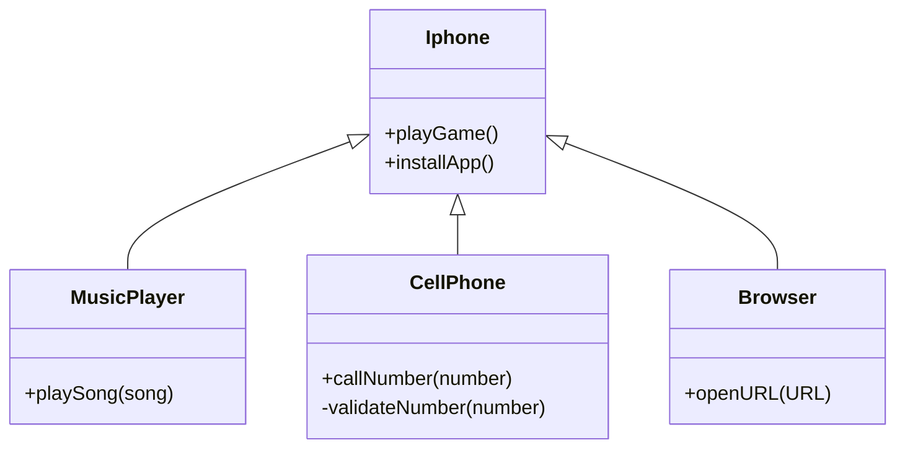

### Representação visual com OOP de como é um Iphone(teste feito com interfaces)

```mermaid
classDiagram
    Iphone <|-- MusicPlayer
    Iphone <|-- CellPhone
    Iphone <|-- Browser
    Iphone: +playGame()
    Iphone: +installApp()

    class MusicPlayer{
        +playSong(song)
    }
    class CellPhone{
        +callNumber(number)
        -validateNumber(number)
    }
    class Browser{
        +openURL(URL)
}
```
